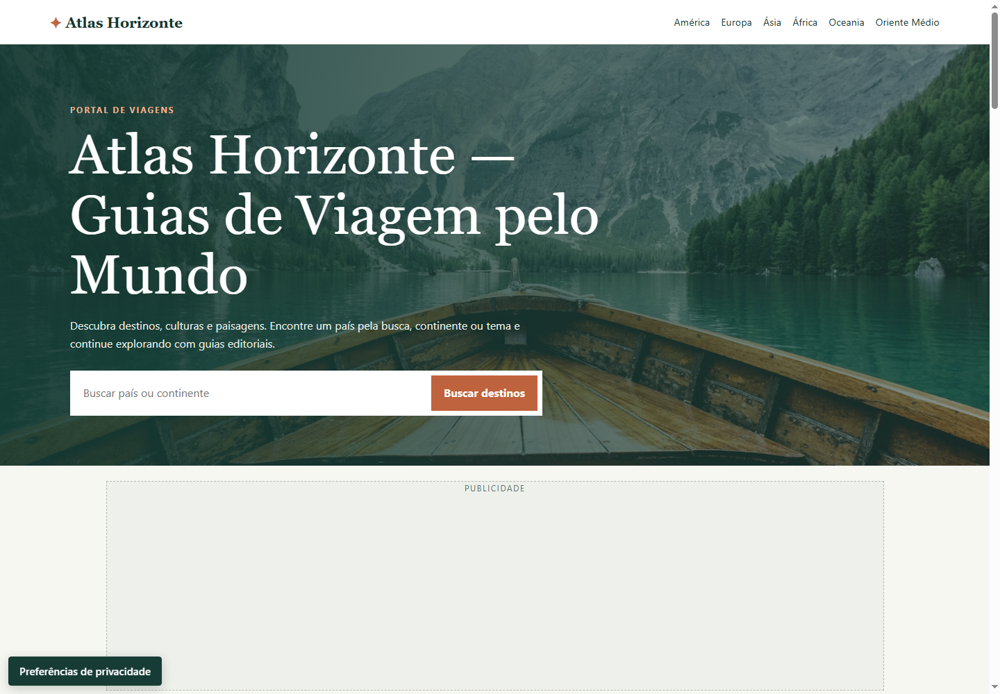
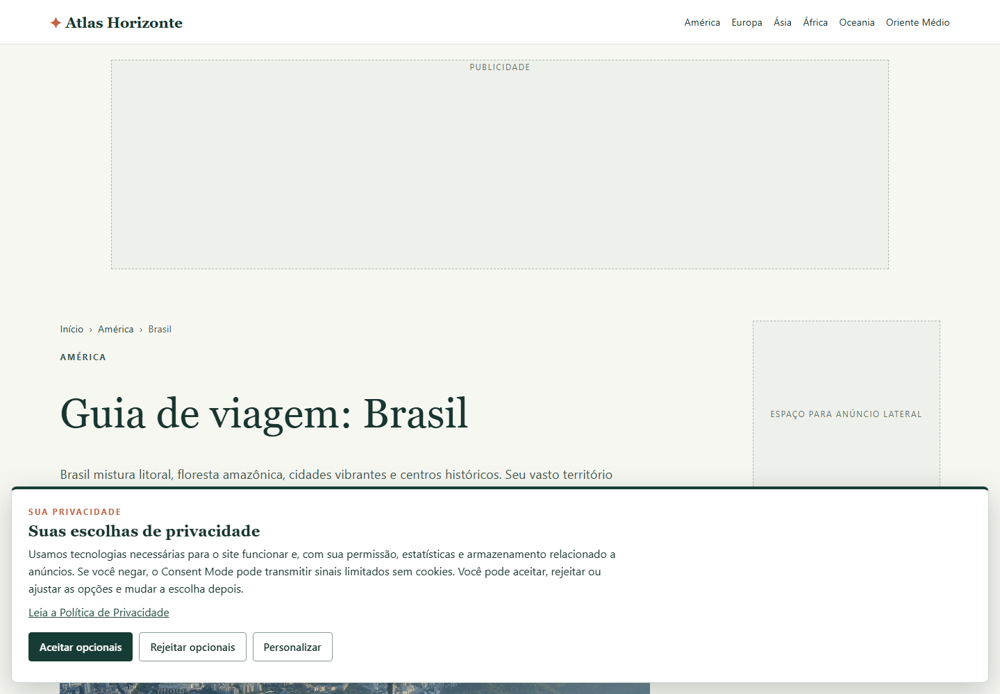
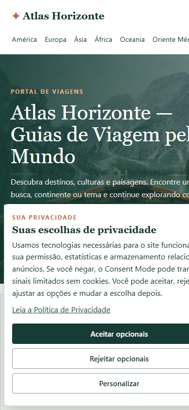
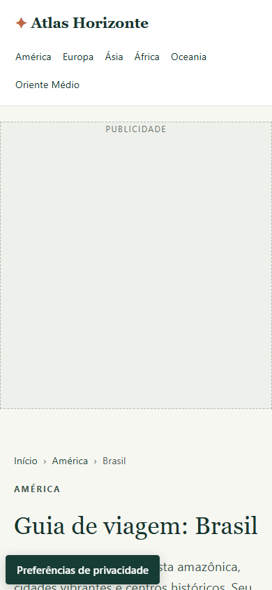

# Atlas Horizonte

## Travel & Destination Discovery Platform

> My first professional portfolio project.

[View Live Demo](https://atlas-horizonte-josuel.web.app/index.html)

## About the Project

Atlas Horizonte is a public travel and destination discovery platform that helps visitors explore countries, regions, cultures, landscapes, and practical travel references through an editorial-style interface.

The project organizes destination guides into a structured browsing experience with continent navigation, destination search, topic filters, and dedicated guide pages.

## Project Goals

- Make destination discovery simple and visually engaging.
- Organize travel content by continent, country, and interest.
- Provide a clear path from discovery to deeper destination guides.
- Present travel information with contextual and responsible guidance.
- Demonstrate practical web development and digital product skills.

## Key Features

- Homepage destination search.
- Continent-based navigation.
- Topic filters for cities, culture and history, nature, and beaches/coasts.
- Dedicated country guide pages.
- Breadcrumb navigation.
- Editorial sections for attractions, travel tips, local context, and further sources.
- About, Contact, Privacy, Terms, and custom 404 pages.
- Privacy preference controls for optional analytics and advertising storage.
- Sitemap and robots configuration.

## User Experience

Visitors can start with a search or continent, filter destinations by interest, and open a focused guide without losing the main navigation context. Destination cards, clear headings, breadcrumbs, and source links guide users from inspiration to practical research.

## Responsive Design

The published build includes responsive CSS rules for different viewport sizes. Navigation, destination grids, content spacing, and guide pages adapt to smaller screens and desktop displays.

## SEO & Discoverability

The published pages implement page-specific titles and meta descriptions, canonical URLs, robots directives, Open Graph and Twitter Card metadata, structured data on destination pages, sitemap.xml, and robots.txt. This README makes no claim about search rankings or traffic results.

## Technical Approach

The live project is a multi-page static website built with semantic HTML, CSS, and browser JavaScript. It uses responsive layout rules, accessible labels and controls, external destination imagery, and consent-aware analytics and advertising integrations. The site is published through Firebase Hosting.

The public GitHub presentation contains documentation and public interface screenshots only. It does not publish the complete implementation source or deployment files.

## Challenges

The project organizes a large destination catalog while keeping navigation understandable, country pages consistent, search and filtering usable, layouts responsive, and analytics and advertising controls privacy-aware by default.

## What I Learned

This project demonstrates practical skills in Web Development, SEO, responsive interaction design, Digital Products, privacy-aware implementation, and content organization. Artificial Intelligence and Automation are areas of ongoing professional study and development, not a claim of already being an AI Engineer.

## Project Status

The public Atlas Horizonte demo is live. This repository is a portfolio presentation layer and does not change the production site.

## Contact

- Email: [josueltopeleven@gmail.com](mailto:josueltopeleven@gmail.com)
- LinkedIn: [Josuel Nabosne](https://www.linkedin.com/in/josuel-nabosne-329739428/)

## Screenshots

### Desktop

#### Atlas Horizonte homepage — desktop

#### Atlas Horizonte destination page — desktop

### Mobile

#### Atlas Horizonte homepage — mobile

#### Atlas Horizonte destination page — mobile

## Safety Note

Production configuration, Firebase files, deployment logs, administrative scripts, caches, credentials, and the complete site source are intentionally excluded.
